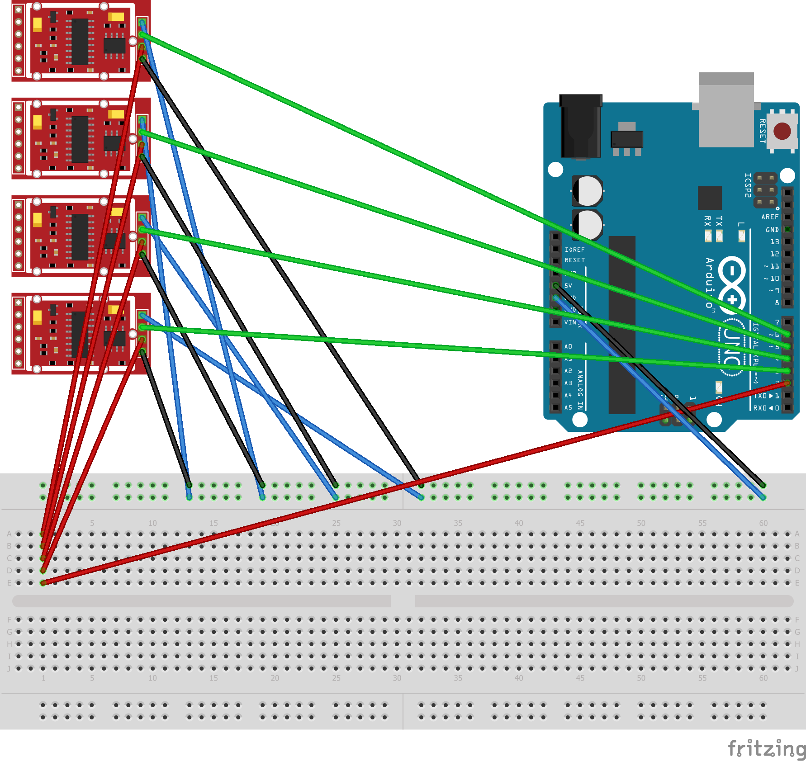
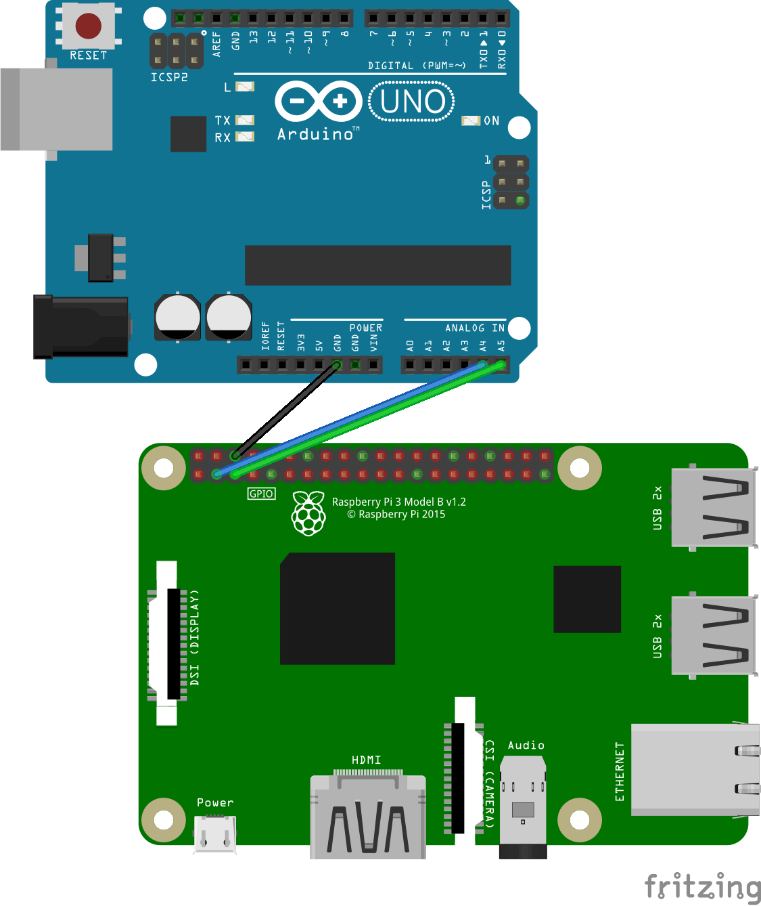
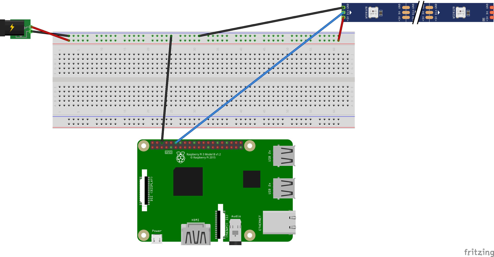
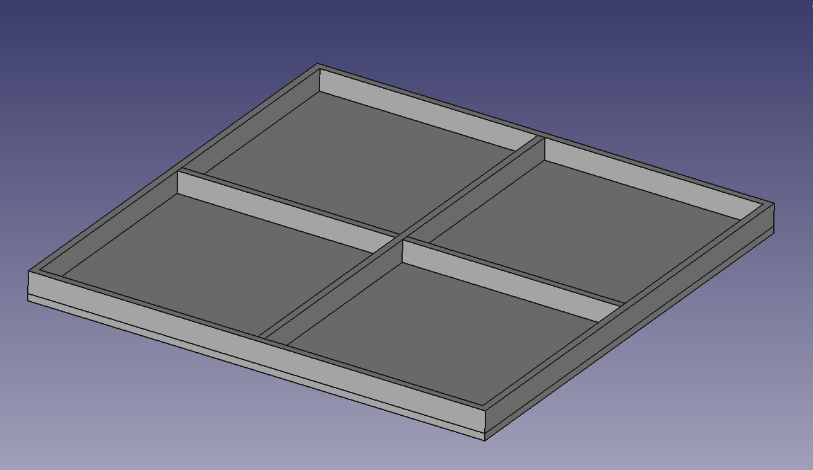
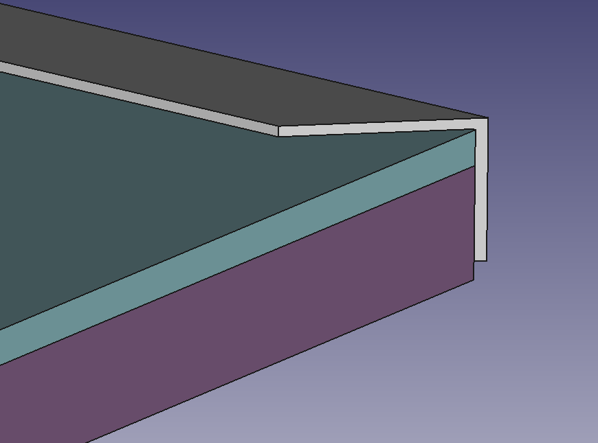
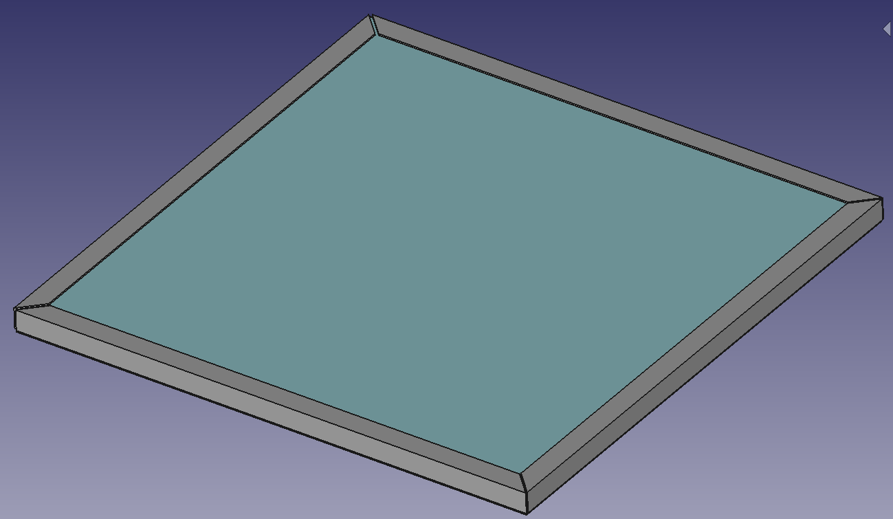
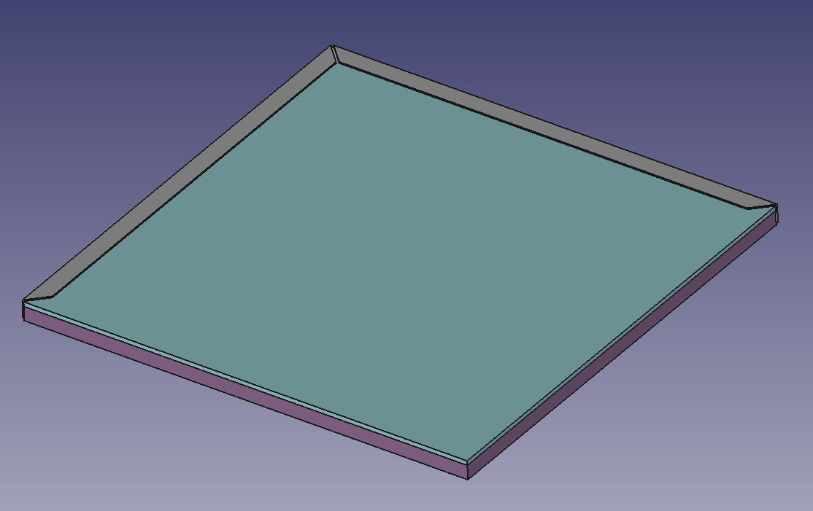

# cyberskakanka

## Wiring the Stuff Together

### Connecting Arduino and Weight Sensors

### Connecting Arduino and Raspberry Pi via I2C

### Connecting Raspberry Pi with WS212B LED Strip

## The Hardware

### The Base

### The Base with Two Tiles Fit

### The Tile

- 16mm MDF on the bottom
- a layer of white cardboard
- 5mm transparent plexi

